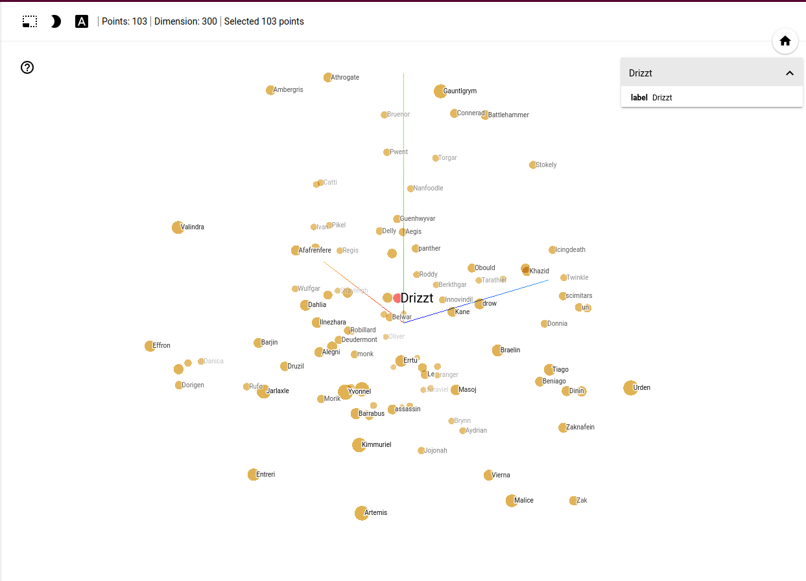

# Realms2Vec

Using Word2Vec to explore semantic similarities between the entities of Forgotten Realms novels.

## Trained model

Instead of training your own Word2Vec, you can use an existing trained model from the [Releases](https://github.com/loremaps/realms2vec/releases) page.

Run this cell in the IPython Notebook:

`w2v.Word2Vec.load(os.path.join("trained", "realms2vec.w2v"))`

## Credits

Credits for this code go to [Yuriy Guts](https://github.com/YuriyGuts/).
